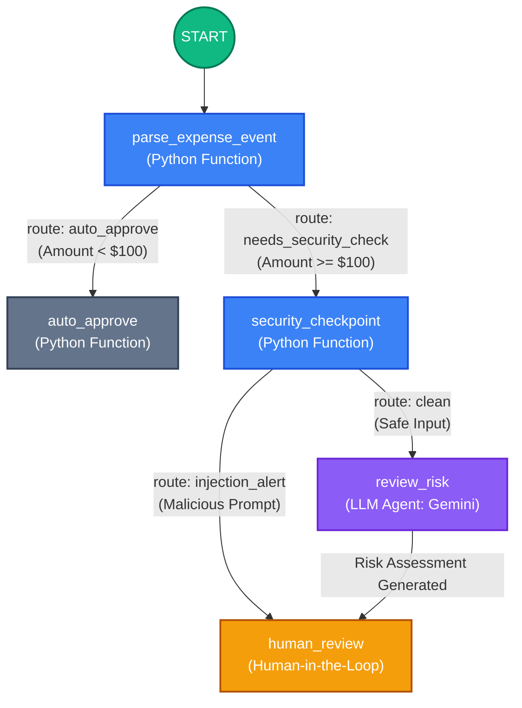

# Ambient Expense Approval Agent

This document provides a detailed technical definition of the **Ambient Expense Approval Agent** workflow. The agent is built using the Google Agent Development Kit (ADK) and operates as a stateful graph-based workflow designed to automatically process, audit, and route employee expense claims.

## Workflow Overview

The core logic of the agent resides in `expense_agent/agent.py`. It uses a directed graph architecture to execute synchronous logic, call Large Language Models (LLMs), and pause for human-in-the-loop (HITL) approval when necessary.

### Execution Graph Diagram

---

## Node Definitions

### 1. `parse_expense_event` (Routing Node)
- **Type**: Python `FunctionNode`
- **Purpose**: Normalizes incoming payloads (from Pub/Sub or direct HTTP requests) into an `ExpenseReport` Pydantic schema.
- **Routing Logic**:
  - If the expense amount is **below** the `AUTO_APPROVE_THRESHOLD` (default $100), the workflow routes directly to the `auto_approve` node.
  - If the amount is **equal to or above** the threshold, it routes to the `needs_security_check` node for deeper inspection.

### 2. `auto_approve` (Action Node)
- **Type**: Python `FunctionNode`
- **Purpose**: Instantly approves low-value expenses without invoking the LLM, reducing latency and token costs.
- **Output**: Generates an `ExpenseDecision` with a status of `APPROVED` and terminates this branch of the workflow.

### 3. `security_checkpoint` (Filter Node)
- **Type**: Python `FunctionNode`
- **Purpose**: Ensures safety and compliance before data is sent to the LLM. 
  1. **PII Scrubbing**: Redacts sensitive data (like SSNs or credit card numbers) from the expense description.
  2. **Prompt Injection Detection**: Analyzes the text for adversarial inputs.
- **Routing Logic**:
  - If an injection is detected, it generates a critical `RiskAssessment` and bypasses the LLM, routing directly to `human_review` with an `injection_alert`.
  - Otherwise, it passes the sanitized text forward (`clean` route).

### 4. `review_risk` (LLM Auditor Node)
- **Type**: ADK `LlmAgent`
- **Model**: `gemini-3.1-flash-lite` (Configurable)
- **Purpose**: Acts as a corporate expense risk auditor. It reads the sanitized `ExpenseReport` and evaluates the context (e.g., weekend dates, vague descriptions, policy violations).
- **Output Schema**: Returns a structured `RiskAssessment` (Pydantic model) containing a summary, risk level (`LOW`, `MEDIUM`, `HIGH`, `CRITICAL`), and specific risk factors.

### 5. `human_review` (Human-in-the-Loop Node)
- **Type**: Python `FunctionNode` with ADK `RequestInput`
- **Purpose**: Pauses the workflow execution and waits for asynchronous manager input (Approve or Reject).
- **Mechanism**: 
  - Emits an `interrupt_id` (e.g., `human_approval`).
  - The workflow state is persisted to the database/memory.
  - When the manager submits their decision via the API (or dashboard), the workflow resumes and finalizes the `ExpenseDecision` based on their input.
