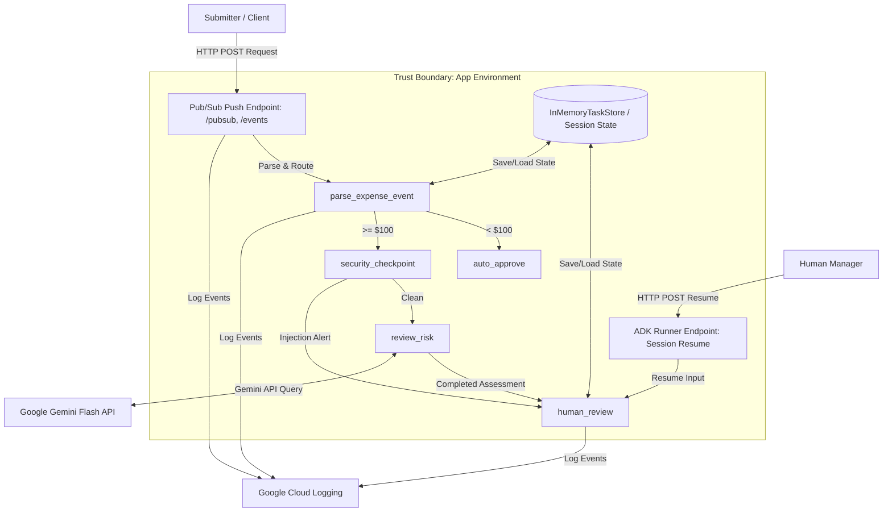

# STRIDE Threat Model Assessment: Ambient Expense Approval Agent

This document presents a systematic threat model for the **Ambient Expense Approval Agent** based on the **STRIDE** methodology. It outlines system boundaries, entry points, trust boundaries, specific security findings, and actionable mitigations to harden the application.

---

## 1. System Architecture & Boundaries

The Ambient Expense Approval Agent is a Python service built with the **Agent Development Kit (ADK)** and **FastAPI**. It processes expense reports asynchronously from a Google Cloud Pub/Sub push subscription and routes them through a rule-based and LLM-assisted verification workflow.

### Data Flow Diagram (DFD)

### Trust Boundaries & Entry Points
1. **Pub/Sub Push HTTP Endpoints**: Exposed at `/`, `/pubsub`, `/events`, `/apps/expense_agent/pubsub` on port `8080` (or `8000`). This is a public-facing API boundary.
2. **A2A / Runner Session Endpoints**: Exposed via ADK's built-in FastAPI application middleware.
3. **Manager Human-in-the-Loop Interaction**: Interactive resume inputs provided via runner endpoints.
4. **Google Gemini LLM Endpoint**: External API dependency over HTTPS.

---

## 2. STRIDE Threat Analysis Matrix

| Threat ID | STRIDE Pillar | Description | Likelihood | Impact | Status / Mitigation |
| :--- | :--- | :--- | :--- | :--- | :--- |
| **T-01** | **S**poofing | Unauthenticated clients spoofing Pub/Sub push notifications to trigger workflows or human approvals. | High | High | **Unmitigated** |
| **T-02** | **T**ampering | Bypassing `security_checkpoint` by manipulating the `amount` field to bypass redactions and prompt injection defenses. | Medium | High | **Unmitigated** |
| **T-03** | **R**epudiation | In-memory session state storage (`InMemoryTaskStore`) is volatile; critical security events or audit trails are lost on restart. | High | Medium | **Unmitigated** |
| **T-04** | **I**nformation Disclosure | PII leaks (e.g., phone numbers, API keys) in raw workflow trace logs or stack trace exposure in public FastAPI responses. | Medium | Medium | **Partially Mitigated** (scrubs SSN and Credit Cards) |
| **T-05** | **D**enial of Service | Flooding `/pubsub` push endpoint to trigger excessive LLM API queries and consume budget/quota. | High | Medium | **Unmitigated** |
| **T-06** | **E**levation of Privilege | Unauthenticated users guessing session IDs and submitting `human_approval` resume inputs to self-approve expenses. | High | Critical | **Unmitigated** |

---

## 3. Detailed Pillar Analysis

### 🔒 Spoofing
- **Finding**: The server exposes endpoint handlers like `handle_pubsub_push` in [server.py](file:///Users/ShahimaIA2/Desktop/adk_ambient_expense_agent/expense_agent/server.py#L53-L57) and [fast_api_app.py](file:///Users/ShahimaIA2/Desktop/adk_ambient_expense_agent/expense_agent/fast_api_app.py#L46-L49) without any authentication or verification.
- **Vulnerability**: Any client on the web can send a POST request with a fake JSON payload matching Pub/Sub data schemas.
- **Mitigation Plan**:
  1. Restrict ingress traffic using GCP API Gateway, Cloud Armor, or direct Pub/Sub verification.
  2. Implement OIDC token verification on the FastAPI server to ensure requests originate exclusively from the Google Cloud Pub/Sub service account.

### 🛠️ Tampering
- **Finding**: In [agent.py](file:///Users/ShahimaIA2/Desktop/adk_ambient_expense_agent/expense_agent/agent.py#L103-L114), expenses with an `amount < 100.0` route directly to `auto_approve`, bypassing the `security_checkpoint` (PII scrubbing and prompt injection detection).
- **Vulnerability**: An attacker can submit sensitive information (like SSNs or credit cards) or prompt injection attacks inside the description field of an expense under $100, and it will bypass all security defenses.
- **Mitigation Plan**:
  1. Route all input data through the `security_checkpoint` at `START`, regardless of the dollar amount.
  2. Perform threshold routing *after* scrubbing and validation.

### 📝 Repudiation
- **Finding**: The system uses `InMemoryTaskStore` in [fast_api_app.py](file:///Users/ShahimaIA2/Desktop/adk_ambient_expense_agent/app/fast_api_app.py#L61) and ADK's default memory session service.
- **Vulnerability**: If the service container crashes or restarts, all records of manager approval decisions, workflow execution logs, and redaction metadata are permanently lost, making forensic analysis impossible.
- **Mitigation Plan**:
  1. Configure ADK to use persistent storage (such as Cloud Firestore or Cloud SQL) for session states.
  2. Export structured logs directly to Cloud Logging (currently partially implemented but relies on volatile memory references for local logs).

### 🔍 Information Disclosure
- **Finding**: PII scrub logic in [security.py](file:///Users/ShahimaIA2/Desktop/adk_ambient_expense_agent/expense_agent/security.py#L23-L42) only targets Social Security Numbers (SSN) and Credit Card numbers.
- **Vulnerability**: Other sensitive data fields (e.g., driver's licenses, bank accounts, emails, or system tokens) submitted in expense descriptions are not redacted and are stored in raw text in the session state.
- **Mitigation Plan**:
  1. Enhance the regex pattern dictionary or utilize Google Cloud DLP API (Data Loss Prevention) for robust enterprise PII detection.
  2. Suppress detailed exception printouts or stack traces on FastAPI endpoint errors.

### 🚫 Denial of Service (DoS)
- **Finding**: The API endpoints trigger workflow executions directly upon receipt of POST payloads. There are no rate limits on FastAPI routes.
- **Vulnerability**: Attackers can flood endpoints with payloads of amount >= $100, forcing the server to make parallel API calls to the Gemini model, exhausting api limits and spiking GCP usage costs.
- **Mitigation Plan**:
  1. Integrate middleware like `slowapi` or configure Cloud Armor rate limiting rules.
  2. Define maximum session concurrency limits on the ADK Runner.

### 👑 Elevation of Privilege
- **Finding**: The human-in-the-loop approval step in [agent.py](file:///Users/ShahimaIA2/Desktop/adk_ambient_expense_agent/expense_agent/agent.py#L264-L272) resumes execution solely based on the payload value of `human_approval` from FastAPI runner APIs.
- **Vulnerability**: Since the runner APIs do not validate authorization headers or user roles, anyone who obtains a valid `session_id` (which is predictable, formatted as `f"{short_sub_name}-{message_id}"`) can POST a request with `{"human_approval": "approve"}` and bypass the manager approval.
- **Mitigation Plan**:
  1. Apply role-based authentication checks (e.g., verifying ID token claims) before resuming workflows containing security-critical decisions.
  2. Use secure, cryptographically random `session_id` generators instead of exposing internal message IDs.

---

## 4. Actionable Remediation Roadmap

1. **[CRITICAL]** Configure authenticating middlewares or JWT validation for Pub/Sub push endpoints.
2. **[CRITICAL]** Enforce role-based access control (RBAC) checks on runner API endpoints before resolving `human_review` interrupts.
3. **[HIGH]** Ensure all workflows pass through `security_checkpoint` at the entry point rather than skipping it for low-value transactions.
4. **[HIGH]** Change `session_id` generation logic in `fast_api_app.py` and `server.py` to use UUIDs instead of predictable Pub/Sub message IDs.
5. **[MEDIUM]** Move session storage from `InMemoryTaskStore` to Cloud Firestore or another persistent database target.
6. **[MEDIUM]** Implement API rate limiting using `slowapi` or API Gateway rules.
